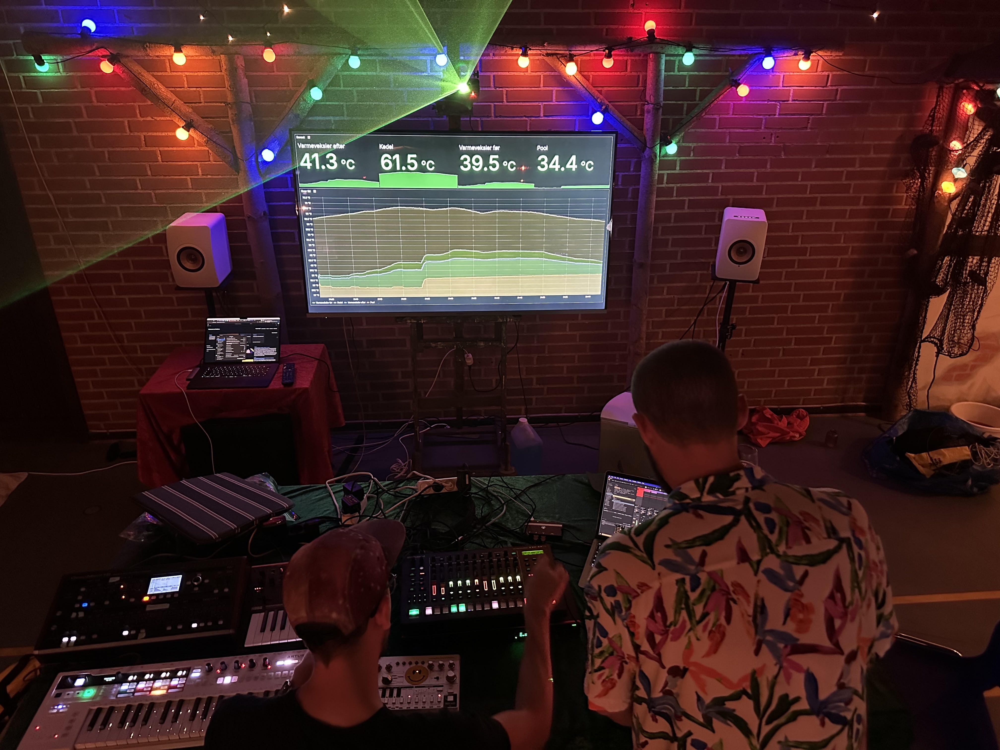
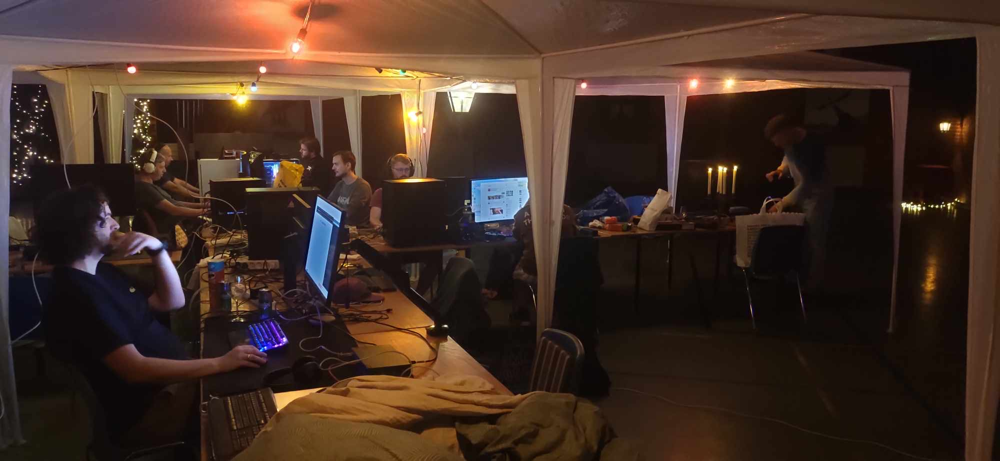
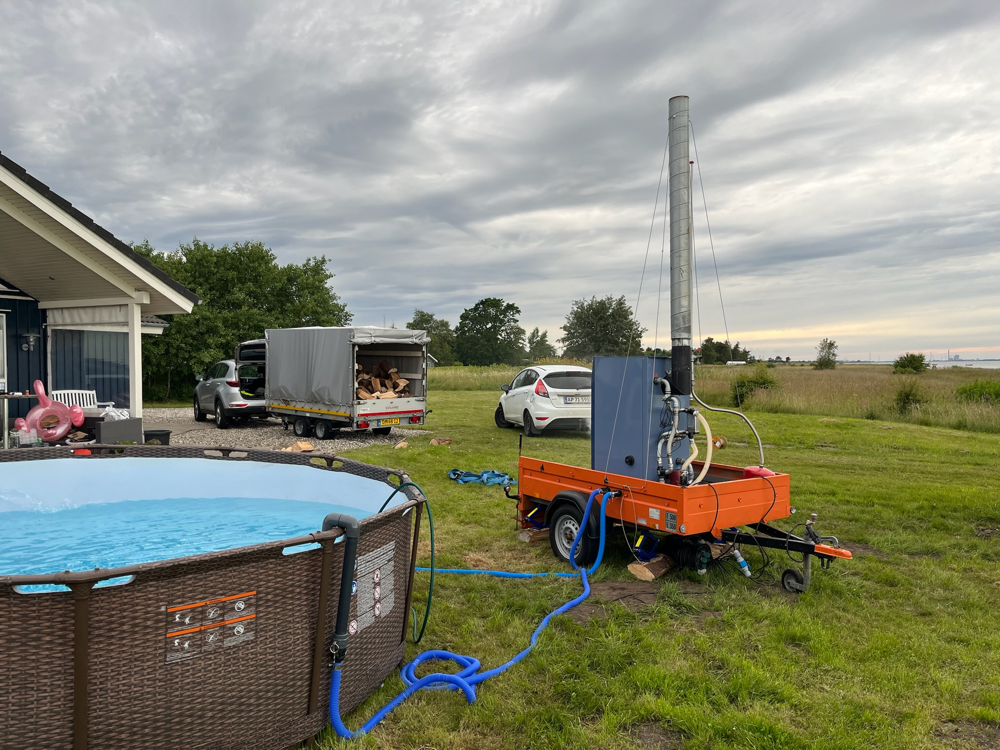

```bash +exec_replace +no_background
figlet -f graffiti -w 120 pool monitor | lolcat -i -f -S 1
```



Agenda
---

<!-- column_layout: [1,3] -->

<!-- column: 1 -->

```bash +exec_replace +no_background
url="https://github.com/thomaschrstnsn/rust-aarhus-nov-2024/"
echo "$url"| qrencode -t utf8i | lolcat -f -i -S 2
```

```
https://github.com/thomaschrstnsn/rust-aarhus-nov-2024/
```


<!-- column: 0 -->

# Intersection

<!-- pause -->

## Summer project
### Learning something new
- ESP32 firmware


<!-- pause -->
## Recreation
- LAN (gaming)
- Pool
- Beers
- Music

<!-- pause -->

## Software 
- Rust 


LAN + Pool = 🤟
---




User story
---

<!-- column_layout: [1,3,1]-->
<!-- column: 1 -->

<!-- jump_to_middle -->
> As a gamer, 
> I want to monitor the outside pool's temperature, 
> while staying inside and gaming uninterrupted

Architecture
---


```bash +exec_replace +no_background
cat << EOF | graph-easy --as=boxart
digraph {
    rankdir=TD;

    subgraph pool_side {
        [label="Furnace/Pool"]
        esp32 [label="ESP32"];
        sensor [label="Temperature Sensor"];
    }
    backend [label="Backend Service"];
    database [label="Database"];
    dashboard [label="Dashboard\nInside Hall\nAttached to big screen TV"]

    esp32 -> sensor [label="1. Poll"];
    esp32 -> backend [label="2. HTTP POST\nover WIFI"]
    backend -> database [label="3. Store readings"]
    dashboard -> database [label="4. Query readings"]
}
EOF
```


Bill of Materials
---

<!-- column_layout: [4,4]-->
<!-- column: 0 -->

# Hardware

## ESP32
<!-- pause -->
- 󱊟 4 MByte flash
-  520 KByte RAM
<!-- pause -->
-  WIFI
-  BlueTooth 
<!-- pause -->
- 󰻟 Tensilica Xtensa 32-bit LX6
- -  RISC
- - 240 MHz (max)
- - dual core

<!-- pause -->

# Sensors
## DS18B20 Sensor
- Range: -55 °C to 125 °C 
- Precision: 0.5°C 
- Interface: One Wire Bus


<!-- pause -->

<!-- column: 1 -->
# Software
## Firmware
<!-- pause -->
- [Embassy](https://github.com/embassy-rs/embassy)
- - HAL
- - async tasks (***without RTOS***)
- - pub/sub
<!-- pause -->
<!-- new_lines: 1 -->
- `no_std`
<!-- pause -->
- - no dynamic memory
- - no collections


<!-- pause -->
## Backend
- [axum](https://github.com/tokio-rs/axum)
- [sqlx](https://github.com/launchbadge/sqlx)

<!-- pause -->

## Database
- PostgreSQL 

<!-- pause -->

## Dashboard
- Grafana 

Pool/Furnace interface
---



Monitoring
---

```bash +exec_replace +no_background
cat << EOF | graph-easy --as=boxart
digraph {
    rankdir=LR;
    compound=true;
    splines=true;
    node [fontname="Handlee"];
    
    subgraph rust {
        label=" Rust Program";
        python_code [label=" Python code"];
    }
}
EOF
```


The end
---
# Slides are here

```bash +exec_replace +no_background
url="https://github.com/thomaschrstnsn/rust-aarhus-nov-2024/"
echo "$url"| qrencode -t utf8i
echo "$url"
```


