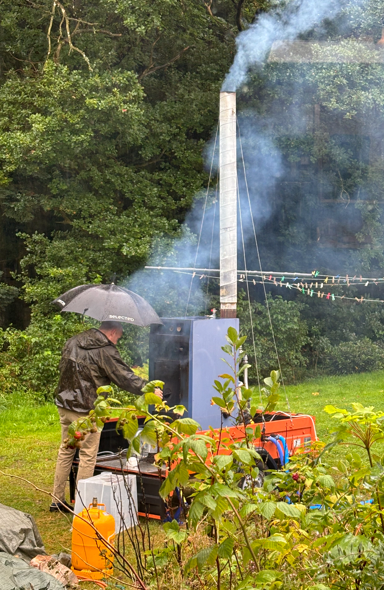
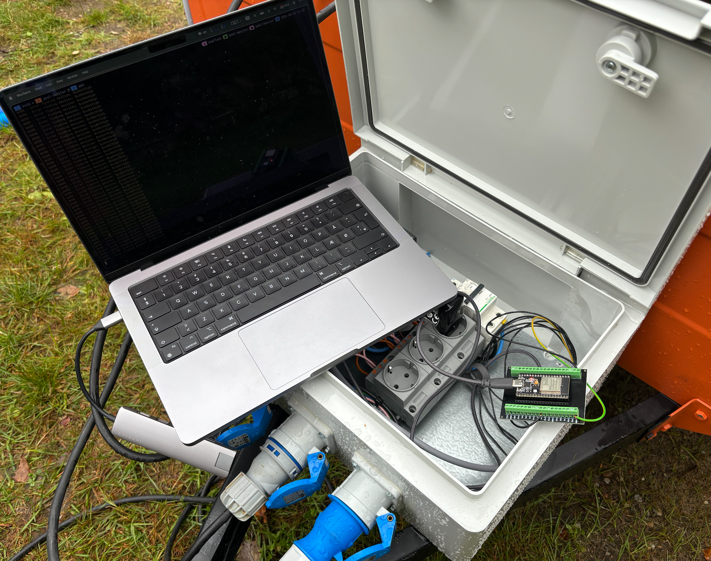

```bash +exec_replace +no_background
figlet -f graffiti -w 120 pool monitor | lolcat -i -f -S 1
```


Agenda
---

<!-- column_layout: [2,4] -->

<!-- column: 1 -->

```bash +exec_replace +no_background
url="https://github.com/thomaschrstnsn/rust-aarhus-nov-2024/"
echo "$url"| qrencode -t utf8i | lolcat -f -i -S 2
```

```
https://github.com/thomaschrstnsn/rust-aarhus-nov-2024/
```


<!-- column: 0 -->

# Intersection

<!-- pause -->

## Summer project
### Learning something new
- ESP32 firmware


<!-- pause -->
## Recreation
- LAN (gaming)
- Pool
- Beers
- Music

<!-- pause -->

## Software 
- Rust 


LAN + Pool = 🤟
---


User story
---

<!-- column_layout: [1,3,1]-->
<!-- column: 1 -->

<!-- jump_to_middle -->
> As a gamer, 
> I want to monitor the outside pool's temperature, 
> while staying inside and gaming uninterrupted

Architecture
---


```bash +exec_replace +no_background
cat << EOF | graph-easy --as=boxart
digraph {
    rankdir=TD;

    subgraph pool_side {
        [label="Furnace/Pool"]
        esp32 [label="ESP32 "];
        sensor [label="Temperature Sensor"];
    }
    backend [label="Backend Service "];
    database [label="Database"];
    dashboard [label="Dashboard\nInside Hall\nAttached to big screen TV"]

    esp32 -> sensor [label="1. Poll"];
    esp32 -> backend [label="2. HTTP POST\nover WIFI"]
    backend -> database [label="3. Store readings"]
    dashboard -> database [label="4. Query readings"]
}
EOF
```


Bill of Materials
---

<!-- column_layout: [4,4]-->
<!-- column: 0 -->

# Hardware

## ESP32
<!-- pause -->
- 󱊟 4 MByte flash
-  520 KByte RAM
<!-- pause -->
-  WIFI
-  BlueTooth 
<!-- pause -->
- 󰻟 Tensilica Xtensa 32-bit LX6
- -  RISC
- - 240 MHz (max)
- - dual core

<!-- pause -->

# Sensors
## DS18B20 Sensor
- Range: -55 °C to 125 °C 
- Precision: 0.5°C 
- Interface: One Wire Bus


<!-- pause -->

<!-- column: 1 -->
# Software
## Firmware
<!-- pause -->
- [Embassy](https://github.com/embassy-rs/embassy)
- - HAL
- - async tasks (***without RTOS***)
- - pub/sub
<!-- pause -->
<!-- new_lines: 1 -->
- `no_std`
<!-- pause -->
- - no dynamic memory
- - no collections


<!-- pause -->
## Backend
- [axum](https://github.com/tokio-rs/axum)
- [sqlx](https://github.com/launchbadge/sqlx)

<!-- pause -->

## Database
- PostgreSQL 

<!-- pause -->

## Dashboard
- Grafana 

Pool/Furnace interface
---


Demo
---

Starting:
- firmware on device
- http backend
- grafana


About debugging...
---



When production looks like this...
---




Can be a little tricky... 😅
---


Firmware overview (1/3) `main.rs`
---

- https://github.com/thomaschrstnsn/pool-monitor

```rust
#[main]
async fn main(spawner: embassy_executor::spawner::Spawner) {
    // get access to HAL for clocks ...

    // setup WIFI with TCP/IP via DHCP ...

    // wait for WIFI to connect (and get IP) ...

    // Get the GPIO pin for 1-wire protocol ...

    spawner.spawn(sensors::read_sensors(ood, delay)).ok();

    spawner.spawn(http::post_updates(stack)).ok();
}
```

Firmware overview (2/3) `sensors.rs`
---

```rust {1|3|5-9|11|13-15}
const NUM_SENSORS: usize = 2;

type Sensors = heapless::vec::Vec<Ds18b20, NUM_SENSORS>;

#[derive(Debug, Clone)]
pub struct Reading {
    pub temperature_celcius: f32,
    pub sensor_address: one_wire_bus::Address,
}

pub type TempMessage = [Reading; NUM_SENSORS];

#[embassy_executor::task]
pub async fn read_sensors(/* ... */);
async fn get_temperature(/* ... */);
```

Firmware overview (3/3) `http.rs`
---
```rust {1-3|5-9}
const POST_ENDPOINT_IP: &str = env!("POST_ENDPOINT_IP");
const POST_ENDPOINT_PORT: &str = env!("POST_ENDPOINT_PORT");
const TIMEOUT_SECS: u64 = 30;

#[embassy_executor::task]
pub async post_updates(/* ... */);
async post_data(/* ... */);
fn create_http_post_request(message: &TempMessage) -> Result<String<1024>, ()>;
fn create_json_payload(message: &TempMessage) -> Result<String<128>, ()>;
```

`read_sensors()`
---

```rust {1-2|3|4|5|7-24}
#[embassy_executor::task]
pub async fn read_sensors(ood: OutputOpenDrain<'static, GpioPin<5>>, mut delay: Delay) {
    let mut one_wire_bus = OneWire::new(ood).expect("creating a one-wire-bus");
    let publisher = TEMP_CHANNEL.dyn_publisher().expect("getting publisher for channel");
    let sensors = find_devices_retry(&mut delay, &mut one_wire_bus, ds18b20::FAMILY_CODE).await;

    let mut c = 0u32;
    loop {
        Timer::after(Duration::from_millis(1_000)).await;

        match get_temperature(&mut delay, &mut one_wire_bus, &sensors).await {
            Ok(readings) => {
                match readings.into_array() {
                    Ok(readings) => {
                        let _ = publisher.publish(readings).await;
                    }
                    // error handling ...
                }
            }
            // error handling ...
        };
        c += 1;
    }
}
```

`get_temperature()` 1/2
---
```rust {1-5|7-8|10-11|13-16}
async fn get_temperature<P, E, const N: usize>(
    delay: &mut impl DelayNs,
    one_wire_bus: &mut OneWire<P>,
    sensors: &Vec<Ds18b20, N>,
) -> OneWireResult<Vec<Reading, N>, E>
where
    P: OutputPin<Error = E> + InputPin<Error = E>,
    E: Debug,
{
    // initiate a temperature measurement for all connected devices
    ds18b20::start_simultaneous_temp_measurement(one_wire_bus, delay)?;

    // wait until the measurement is done. This depends on the resolution you specified
    // If you don't know the resolution, you can obtain it from reading the sensor data,
    // or just wait the longest time, which is the 12-bit resolution (750ms)
    Resolution::Bits12.delay_for_measurement_time(delay);

    //...
```

`get_temperature()` 2/2
---
```rust {2|3-4|5-21}
    // ...
    let mut result = Vec::new(); // infers to heapless::vec::Vec<Reading, N>
    for sensor in sensors {
        let mut retry = 0;
        loop {
            let res = match sensor.read_data(one_wire_bus, delay) {
                Ok(sensor_data) => {
                    // logging ...
                    let _ = result.push(Reading {
                        sensor_address: *sensor.address(),
                        temperature_celcius: sensor_data.temperature,
                    });
                    Ok(())
                }
                Err(e) => {
                    // error handling / retry ...
                }
            };
            res?;
            break;
        }
    }
    Ok(result)
}
```

`post_updates()`
---
```rust {1-2|3-5|7-8|12-16}
#[embassy_executor::task]
pub async fn post_updates(stack: &'static Stack<WifiDevice<'static, WifiStaDevice>>) {
    let mut subscriber = TEMP_CHANNEL
        .dyn_subscriber()
        .expect("creating subscriber for temperature updates");

    let endpoint_ip = parse_ip(POST_ENDPOINT_IP);
    let endpoint_port = POST_ENDPOINT_PORT.parse::<u16>().expect("parsing port");

    log::info!( "Connecting to IP: {:?} Port: {}", endpoint_ip, endpoint_port);

    loop {
        match subscriber.next_message().await {
            WaitResult::Message(temp) => {
                post_data(stack, endpoint_ip, endpoint_port, &temp).await;
            }
            WaitResult::Lagged(lag_count) => {
                log::error!(
                    "We are lagging our subscription of temperature updates: {}",
                    lag_count
                );
            }
        }
    }
}
```

`post_data()` (1/2)
---

```rust {1-5|7-8|9-10|12|15-18|20}
async fn post_data(
    stack: &'static Stack<WifiDevice<'static, WifiStaDevice>>,
    ip: Ipv4Address,
    port: u16,
    message: &TempMessage,
) {
    let mut rx_buf = [0; 8192]; // re: stacks
    let mut tx_buf = [0; 8192];
    let mut socket = TcpSocket::new(stack, &mut rx_buf, &mut tx_buf);
    socket.set_timeout(Some(embassy_time::Duration::from_secs(TIMEOUT_SECS)));

    let r = socket.connect((ip, port)).await;
    // error handling

    let request = create_http_post_request(message);
    // error handling

    let request = request.unwrap();

    let r = write_all(&mut socket, &request.into_bytes()).await;
    // error handling

    ...
```

`post_data()` (2/2)
---
```rust {2|3-10|12-18}
    ...
    let mut buf = [0; 8192];
    let n = match socket.read(&mut buf).await {
        Ok(0) => {
            log::error!("Server closed connection");
            return;
        }
        Ok(n) => n,
        // error handling
    };

    log::info!(
        "response from server: {}",
        core::str::from_utf8(&buf[..n])
            .expect("utf8 from server")
            .lines()
            .next()
            .unwrap_or("")
    );
}

```

`create_http_post_request()`
---
```rust {1|2|4|6|8-11|13-14|16}
fn create_http_post_request(message: &TempMessage) -> Result<String<1024>, ()> {
    let mut request = String::new();

    let payload = create_json_payload(message)?;

    request.push_str("POST /data HTTP/1.1\r\n")?;

    request.push_str("Content-Type: application/json\r\n")?;
    request.push_str("Content-Length: ")?;
    let mut buf = [0u8; 5];
    request.push_str(payload.len().numtoa_str(10, &mut buf))?;

    request.push_str("\r\n\r\n")?;
    request.push_str(payload.as_str())?;

    Ok(request)
}
```

Wrapping up
---

- TODO


The end
---
# Code is here
- https://github.com/thomaschrstnsn/pool-monitor
- https://github.com/thomaschrstnsn/pool-monitor-backend

```bash +exec_replace +no_background
echo "https://github.com/thomaschrstnsn/rust-aarhus-nov-2024/"| qrencode -t utf8i
```

```
https://github.com/thomaschrstnsn/rust-aarhus-nov-2024/

```

```
https://github.com/thomaschrstnsn/pool-monitor
https://github.com/thomaschrstnsn/pool-monitor-backend
```


