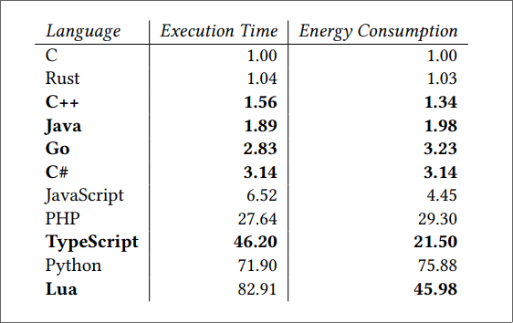

# Agenda
- Motivation
- - Python
- - Efficiency
- - Comparison with Rust
---
- Examples from the Python ecosystem
- Introduction to `PyO3` / `maturin`
---
- Demo (getting started)
- - "What do we get 'out of the box'?"
---
- Examples
- - returning values from Rust: todo: https://pyo3.rs/v0.23.0/conversions/tables.html
- - `struct` from Rust
- - `dict` from Python
- - `callable` from Python

TODO: https://pyo3.rs/v0.23.0/performance.html#extract-versus-downcast

---
- Integration:
- - Static vs dynamic typing
- - Borrow checking vs garbage collection
- - logging: todo: https://pyo3.rs/v0.23.0/ecosystem/logging.html#logging


<!-- end_slide -->
# Python is Great!

- Python is very widely used, especially in "data" contexts
- Easy to use and get started with
- Dynamically typed


<!-- end_slide -->

Comparing Rust and Python
---

# Syntax

<!-- column_layout: [1,1] -->

<!-- column: 0 -->

```python {1-2|4-8|10-13} +exec
def my_function(x: int, y: int) -> int:
    return x + y

from dataclasses import dataclass
@dataclass
class MyData:
    a: int
    b: int

def main():
    result = my_function(2, 3)
    data = MyData(a = 42, b = 0)
    print(f"{result}: a: {data.a} b: {data.b}")

main()

```

<!-- column: 1 -->

```rust {1-3|5-8|10-15} +exec
fn my_function(x: i64, y: i64) -> i64 {
    x + y
}

struct MyData {
    a: i64,
    b: i64,
}

fn main() {
    let result = my_function(2,3);
    let data = MyData{a: 42, b: 0};
    println!("{result}: a: {} b: {}", 
        data.a, data.b);
}
```

Comparing Rust and Python
---

<!-- column_layout: [3,3] -->
<!-- column: 0 -->


# Rust
<!-- pause  -->
<!-- incremental_lists: true -->

- compiled
- statically typed
<!-- new_lines: 1 -->
<!-- pause -->

## TIOBE number 14 (1.17%)

<!-- pause -->
<!-- incremental_lists: true -->
## selling points
<!-- pause -->
- - performance
- - type and memory safety
- - borrow checker (no garbage collector)
- - immutability is the default
- - concurrency


<!-- pause  -->


<!-- column: 1 -->

# Python
<!-- pause  -->

<!-- incremental_lists: true -->
- interpreted
- dynamically typed
- - support for optional typing using [`mypy`](https://github.com/python/mypy)
<!-- new_lines: 1 -->
<!-- pause -->
## TIOBE most popular language (22%)
<!-- pause -->
<!-- incremental_lists: true -->

## selling points
<!-- pause -->
- - one of the most popular programming languages
- - focus on code readability
- - significant indentation (!)
- - widespread use in the machine learning community


Python Efficiency
---
- Pure Python can be 75x slower than "native" (`C`/`C++`/`Rust`)
- TODO: cloud bill, datacenter, environment

<!-- pause -->



> Source: [It's Not Easy Being Green: On the Energy Efficiency of Programming Languages](https://arxiv.org/abs/2410.05460)

> Their experiments leverage Intel’s Running Average Power Limit (RAPL) interface to measure energy consumption, and
> GNU time or Python’s memory_profiler to measure peak or “total” memory usage, respectively.
> The programs used for comparison are from the Computer Language Benchmark Game (CLBG)

Notable examples of Python libraries implemented in more efficient languages
---

# Popular libraries in the Python ecosystem
<!-- pause -->

## [`NumPy`](https://numpy.org/) 
> The fundamental package for scientific computing with Python.
- Implemented in C & Python

<!-- pause -->

## [`pandas`](https://pandas.pydata.org/) - `DataFrames`
> `pandas` is a fast, powerful, flexible and easy to use data analysis and manipulation tool
- Critical paths are written in Cython or C

<!-- pause -->
## [`Polars`](https://pola.rs/) 
- "`pandas` in Rust", 50x speedup

<!-- pause -->
## [`bytewax`](https://bytewax.io/)
>  Stream processing as easy as Py
- Implemented in Python and Rust 
- - Utilizing the Rust crate [`timely`](https://github.com/TimelyDataflow/timely-dataflow)


What is PyO3?
---

- Rust bindings for Python. Allowing you to write Rust modules to be consumed in a Python application.
- And vice versa (Rust calling into Python), although not covered here...


Demo (getting started)
---

# Ensuring we have `maturin`, `cargo` and `python` installed

```bash +exec
maturin --version
cargo --version
python --version
```

<!-- end_slide -->

Demo (getting started)
---
# Create a new PyO3 `cargo` project

```bash +exec
maturin new --mixed -b pyo3 demo-project
```

Demo (getting started)
---
# See what we got

```bash +exec
tree -a demo-project
```

Demo (getting started)
---
# The `cargo` project

```file {1-4|6-8|10-11}
path: frozen-demo-project/Cargo.toml
language: rust
```

Demo (getting started)
---
# The `rust` code

```file {1|3-7|9-14} +line_numbers
path: frozen-demo-project/src/lib.rs
language: rust
```

Demo (getting started)
---
# The `python` project

```file +line_numbers
path: frozen-demo-project/pyproject.toml
language: toml
```

Demo (getting started)
---
# The `python` code

```file +line_numbers
path: frozen-demo-project/python/tests/test_all.py
language: python
```

Demo (getting started)
---
# Building the `rust` code into a `python` module


## Setup Python Virtual Env as destination 
```bash
cd demo-project
python -m venv .venv --prompt demo-py
source .venv/bin/activate
```

## Building
```bash
maturin develop
```

## Testing
```bash
pip install pytest
pytest
```

Next
---
