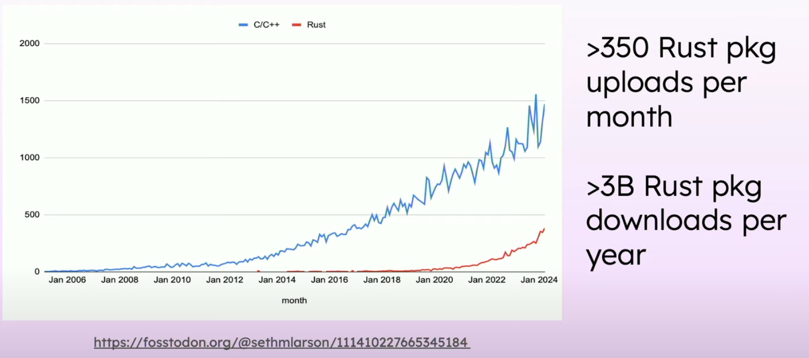

`whoami`
---


<!-- column_layout: [1,1] -->

<!-- column: 0 -->
## first paid software -> 2004
## Professional: 󰙲    
## Hobby:   

<!-- column: 1 -->
## Business domains: 
*Mobile OS* - public job centres - *agriculture* - classifieds - *energy trading* - proprietary trading

<!-- reset_layout -->

```bash +exec_replace +no_background
url="https://github.com/thomaschrstnsn/rust-aarhus-nov-2024/"
echo "$url"| qrencode -t utf8i
```

```
https://github.com/thomaschrstnsn/rust-aarhus-nov-2024/
```


Agenda
---
# Comparing Python to Rust
Motivation for writing Python packages in other languages ⚡️
<!-- pause -->

# PyO3
Rust crate that can be used to generate a native Python module

<!-- pause -->
## How does it work?

<!-- pause -->

## How to get started?

<!-- pause -->

## Tips and Tricks


Comparing Python   with Rust  - Syntax
---

<!-- column_layout: [1,1] -->

<!-- column: 0 -->

```python {1-2|4-8|11-12|14-15} +exec
def my_function(x: int, y: int) -> int:
    return x + y

from dataclasses import dataclass
@dataclass
class MyData:
    a: int
    b: int

def main():
    result = my_function(2, 3)
    print(f"result {result}")

    data = MyData(a = 42, b = 0)
    print(f"a: {data.a} b: {data.b}")

main()

```

<!-- column: 1 -->

```rust {1-3|5-8|11-12|14-16} +exec
fn my_function(x: i64, y: i64) -> i64 {
    x + y
}

struct MyData {
    a: i64,
    b: i64,
}

fn main() {
    let result = my_function(2,3);
    println!("result {result}");

    let data = MyData{a: 42, b: 0};
    println!("a {} b: {}", 
        data.a, data.b);
}
```

Comparing Python   with Rust  - High level
---

<!-- column_layout: [1,1] -->

<!-- column: 0 -->

# Python

<!-- incremental_lists: true -->
## interpreted
## dynamically typed
<!-- pause -->
- static typing with [`mypy`](https://github.com/python/mypy)
<!-- new_lines: 1 -->
<!-- pause -->
<!-- incremental_lists: true -->

## Selling points
<!-- pause -->
- - one of the most popular programming languages
- - focus on code readability
- - significant indentation (!)
- - widespread use in the machine learning community
<!-- pause -->
<!-- incremental_lists: false -->
## TIOBE most popular language (22%)
## Stack Overflow 2024 Survey
- Desired 42% 
- Admired 68%

<!-- pause -->

<!-- column: 1 -->

# Rust
<!-- pause  -->
<!-- incremental_lists: true -->
## compiled
## statically typed
<!-- new_lines: 4 -->
<!-- pause -->
<!-- incremental_lists: true -->
## Selling points
<!-- pause -->
- - performance
- - type and memory safety
- - borrow checker (no garbage collector)
- - immutability is the default
- - concurrency


<!-- pause -->

<!-- incremental_lists: false -->
## TIOBE number 14 (1.17%)
## Stack Overflow 2024 Survey
-  Desired 29% 
- Admired 83%


Comparing Python   with Rust  - Efficiency
---


> Source: [It's Not Easy Being Green: On the Energy Efficiency of Programming Languages](https://arxiv.org/abs/2410.05460)

> Their experiments leverage Intel’s Running Average Power Limit (RAPL) interface to measure energy consumption, and
> GNU time or Python’s memory_profiler to measure peak or “total” memory usage, respectively.
> The programs used for comparison are from the Computer Language Benchmark Game (CLBG)

<!-- pause -->

# Pure Python is ~75x slower than "native" languages (`C`/`C++`/`Rust`)

<!-- pause -->
<!-- incremental_lists: true -->
- Impacts: 
- - hosting bills 💸
- - environment 🌍 🔌

Python libraries implemented in more efficient languages
---

# [Popular libraries in the Python ecosystem](https://pypistats.org)
<!-- pause -->

## [`NumPy`](https://numpy.org/) 
> The fundamental package for scientific computing with Python.
- Implemented in C & Python
- Downloads last month: 319,934,331

<!-- pause -->

## [`pandas`](https://pandas.pydata.org/) - `DataFrames`
> pandas is a fast, powerful, flexible and easy to use data analysis and manipulation tool
- Critical paths are written in Cython or C
- Downloads last month: 253,891,605

<!-- pause -->
## [`Polars`](https://pola.rs/) 
- "`pandas` in Rust", 50x speedup
- Downloads last month: 9,275,321


Python tools implemented in more efficient languages
---

# [Rust tools in the Python ecosystem](https://pypistats.org)

<!-- pause -->

## [`ruff`](https://docs.astral.sh/ruff/)
> An extremely fast Python linter and code formatter, written in Rust.
> ⚡️ 10-100x faster than existing linters (like Flake8) and formatters (like Black)
- Downloads last month: 30,524,476

<!-- pause -->

## [`uv`](https://docs.astral.sh/uv/)
> An extremely fast Python package and project manager, written in Rust.
> ⚡️ 10-100x faster than pip.
- Downloads last month: 18,159,832


Rust   Impact on PyPI
---


> [PyCon US 2024: David Hewitt - How Python Harnesses Rust through PyO3](https://www.youtube.com/watch?v=UilujdubqVU&t=733s)

What is PyO3?
---

- Rust bindings for Python. Allowing you to write Rust modules to be consumed in a Python application.


```bash +exec_replace +no_background
cat << EOF | graph-easy --as=boxart
digraph {
    rankdir=LR;
    compound=true;
    splines=true;
    node [fontname="Handlee"];
    
    subgraph python {
        label=" Python Program";
        rust_code [label=" Rust code"];
    }
    
}
EOF
```

```bash +exec_replace +no_background
cat << EOF | graph-easy --as=boxart
digraph {
    rankdir=LR;
    compound=true;
    splines=true;
    node [fontname="Handlee"];
    
    subgraph rust {
        label=" Rust Program";
        python_code [label=" Python code"];
    }
}
EOF
```

How PyO3 works
---

```rust {1}
#[pyfunction]
fn rust_function() { ... }
```

- Proc Macro which adds Rust code that targets Python's C API

<!-- pause -->

```rust
unsafe extern "C" fn __wrap() { ... }

PyMethodDef {
    ml_meth: __wrap as *mut c_void,
    ...
}
```

<!-- pause -->

- `Maturin` handles the task of compiling the Rust code to a library placed where Python can consume it.

```
┌−−−−−−−−−−−−−−−−┐                ┌−−−−−−−−−−−−−−−−−−−−−−−−−−┐
╎   Rust crate  ╎                ╎   Python C API Library  ╎
╎                ╎                ╎                          ╎
╎ ┌────────────┐ ╎  compilation   ╎ ┌──────────────────────┐ ╎
╎ │    b.rs    │ ╎ ─────────────▶ ╎ │       b.pyd 󰨡        │ ╎
╎ └────────────┘ ╎                ╎ └──────────────────────┘ ╎
╎                ╎                ╎ ┌──────────────────────┐ ╎
└−−−−−−−−−−−−−−−−┘                ╎ │  b.so              │ ╎
                                  ╎ └──────────────────────┘ ╎
                                  └−−−−−−−−−−−−−−−−−−−−−−−−−−┘
```


How PyO3 works - Python side
---

```python
import b
```
<!-- pause -->

- Can tell Python to:
<!-- new_lines: 1 -->
- - import `b.py` and import classes and functions

<!-- new_lines: 1 -->
<!-- pause -->

- - import `b/__init__.py`
<!-- new_lines: 1 -->

<!-- pause -->


- - import a correctly named compiled library

<!-- pause -->
```bash +exec_replace +no_background
cat << EOF | graph-easy --as=boxart
digraph {
    rankdir=LR;
    compound=true;
    splines=true;
    node [fontname="Handlee"];

    source [label=" b.rs"];
    python_capi [label=" Python C API Library"];
    python [label=" Python\nimport b"];

    source -> python_capi [label="1. compilation"]
    python -> python_capi [label="2. import"]
}
EOF
```


Demo (getting started)
---

# Ensuring we have `maturin`, `cargo` and `python` installed

```bash +exec
maturin --version
cargo --version
python --version
```

<!-- end_slide -->

Demo (getting started)
---
# Create a new PyO3 `cargo` project

```bash +exec
maturin new --mixed -b pyo3 demo-project
```

Demo (getting started)
---
# See what we got

```bash +exec
tree -a demo-project
```

Demo (getting started) - `Cargo.toml`
---
# The `Cargo.toml` project file

```file {1-4|6-8|10-11}
path: frozen-demo-project/Cargo.toml
language: rust
```

Demo (getting started) - `lib.rs`
---
# The Rust code

```file {1|3-7|9-14}
path: frozen-demo-project/src/lib.rs
language: rust
```

Demo (getting started) - `pyproject.toml`
---
# The  Python project

```file +line_numbers
path: frozen-demo-project/pyproject.toml
language: toml
```

Demo (getting started) - `test_all.py`
---
# The  Python code

```file +line_numbers
path: frozen-demo-project/python/tests/test_all.py
language: python
```

Demo (getting started) - Building and Running
---
# Building the  Rust code into a  Python module

<!-- pause -->

## Setup Python Virtual Env as destination 
```bash
cd demo-project
python -m venv .venv --prompt demo-py
source .venv/bin/activate
```

<!-- pause -->

## Building
```bash
maturin develop
```

<!-- pause -->

## Testing
```bash
pip install pytest
pytest
```

TODO: Tips and Tricks
---

The end
---
# Thanks for listening

# Questions?

# Slides are here

```bash +exec_replace +no_background
url="https://github.com/thomaschrstnsn/rust-aarhus-nov-2024/"
echo "$url"| qrencode -t utf8i
```

```
https://github.com/thomaschrstnsn/rust-aarhus-nov-2024/
```

